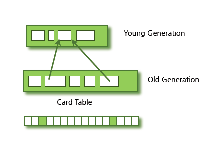

C언어 - free()
Java - 사용하지 않는 메모리를 자동으로 회수하는 시스템인 Garbage Collection 사용

# GC의 동작 원리
객체 참조 그래프(Object Reference Graph)를 사용하여 어떤 객체가 여전히 사용 중인지 여부를 판단한다.
가장 일반적인 방식으로는 참조 카운팅과 마크-스윕(Mark and Sweep) 방식을 사용한다.

1) 참조 카운팅(Reference Counting)
- 객체에 참조되는 횟수를 기록하고, 참조 횟수가 0이 되면 해당 객체는 필요하지 않다고 판단하여 메모리를 해제한다.
- 순환 참조 문제가 있어 단독으로는 잘 사용되지 않는다(참조 : [Reference Counting 문제](https://blog.naver.com/jyk2367/222689587168?))

2) Mark and Sweep
- **Mark 단계** : GC는 루트 객체들(Root)에서 시작해 도달할 수 있는 모든 객체를 "사용중"으로 표시.
- **Sweep 단계** : 표시되지 않은 객체들은 전부 사용할 수 없다고 간주해 메모리에서 해제.

# GC 영역

Generational Hypothesis(세대 가설)을 기반으로 설계되었다.
- 대부분의 객체는 금방 접근불가능한(Unreachable) 상태가 된다.
- 오래된 객체에서 새로운 객체로의 참조는 아주 적게 존재한다.

## 1.Young Generation
- 객체가 처음 생성되는 영역
  - 하지만 큰 객체들은 바로 Old 영역에 할당됨
- 대부분의 객체가 처음 생성되고 금방 필요 없어져 이 영역에서 해제됨
  - 그래서 크기도 Old Generation에 비해 작음.
- Eden, Survivor 영역으로 또 나뉨.
  - Eden : 새로 생성된 객체가 할당되는 영역.
  - Survivor : 최소 1번의 GC 이상 살아남은 객체가 존재하는 영역
- Minor GC 발생
  - Young 영역에서 마크되어 있는 데이터를 제외한 뒤, Old 영역에 있는 Card Table로 참조되고 있는 데이터를 제외하고 최종 해제.
- Young 영역과 Old 영역을 동시에 처리하는 GC는 Full GC라고 함 

### Minor GC
- Eden 영역이 꽉 차면 Minor GC가 발생.
- 사용되지 않는 메모리는 해제되고 Eden 영역에 존재하는 객체는 Survivor 영역으로 옮겨짐.
- Survivor 영역은 총 두 개(From, To)이지만 반드시 1개의 영역에만 데이터가 존재해야 함.

#### Minor GC 동작 순서

1. 새로 생성된 객체가 Eden에 할당된다.
2. 객체가 계속 생성되어 Eden 영역이 꽉 차게 되고, Minor GC가 실행된다.
   1) Eden 영역에서 사용되지 않는 객체의 메모리가 해제된다.
   2) Eden 영역에서 살아남은 객체는 1개의 Survivor 영역으로 이동된다.
3. 1~2번 과정을 반복하다가 Survivor 영역이 가득 차면 Survivor 영역의 살아남은 객체를 다른 Survivor 영역으로 이동시킨다
   - 1개의 Survivor 영역은 반드시 빈 상태가 된다.
4. 이러한 과정을 반복해 계속해서 살아남은 객체는 Old 영역으로 이동된다(Promotion).

## 2. Old Generation
- Young 영역에서 Reachable 상태를 유지하여 살아남은 객체가 복사되는 영역.
- 영역의 크기가 Young보다 크게 할당되고, 가비지는 적게 발생한다.
- Old 영역에 대한 가비지 컬렉션(Garbage Collection)을 Major GC라고 부름.
- Card Table이 존재
  - 512 byte의 덩어리(Chunk)로 나누어짐.
  - Young Generation의 객체를 참조하고 있는지 마킹해둔 테이블.

### Major GC
- 객체들이 계속 Promotion되어 Old영역의 메모리가 부족해지면 발생한다.
- Young 영역을 참조하고 있는 부분도 있고, Young영역보다 크기가 크기 때문에 시간이 오래 걸린다(일반적으로 10배)

# GC 동작 방식

1. **Stop the world**
- JVM 앱의 실행을 멈춤.
- GC를 실행하는 쓰레드 제외 모든 쓰레드 작업 중단
  - 매우 큰 문제, 성능 저하의 원인이라 이 시간을 줄이는게 GC 튜닝의 핵심.
  - 최신 GC는 이 시간을 줄이기 위해 최적화되어 있음.
  - Epsilon, ZGC, G1, Parallel, ConcMarkSweep, Serial, Shenandoah....
2. **Mark and Sweep**
- Mark : 사용되는 메모리와 사용되지 않는 메모리를 식별하는 작업
- Sweep : Mark단계에서 사용되지 않는 메모리 해제하는 작업
